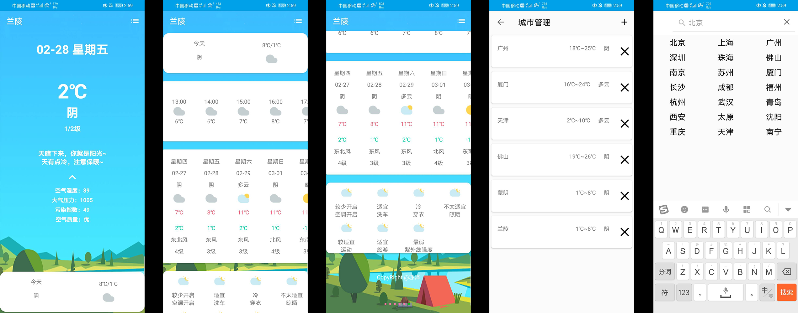

# MiniWeather

by 亦泽

---

MiniWeather 是抓取腾讯天气API之后，制作的一款中颜值天气APP

## 效果截图



## 1、腾讯天气API抓取

---

### 天气状况请求接口

这是腾讯天气的通用请求接口

    https://wis.qq.com/weather/common

#### 请求参数

|参数|含义|
|---|---|
|source|请求来源，可以填 pc 即来自PC端|
|province|省，比如山东省|
|city|市，比如临沂市|
|country|县区，比如兰山区|
|weather_type|请求的天气类型，这里是最重要的，参数有：observe(观测站数据，例如温度大气压)，forecast_1h（按小时预报），forecast_24h（按天预报），index（指数，比如穿衣指数等），alarm（警告），limit，tips（小提示），rise（日出日落，月出月落），air（空气质量）等 |

#### 使用说明

GET请求后面的weather_type内容参数之间用 | 分割，然后再进行URL编码。province和city也要经过URL编码。

#### 代码实现

```java
    private static String txWeatherURLBuilder(Map<String,String> map){
        StringBuilder sb=new StringBuilder();
        for(String key:map.keySet()){
            try {
                sb.append(key+"=");
                sb.append(URLEncoder.encode(map.get(key),"utf-8"));
                sb.append("&");
            } catch (UnsupportedEncodingException e) {
                e.printStackTrace();
            }
        }
        sb.append("source=pc");
        String baseApi="https://wis.qq.com/weather/common";
        return baseApi+"?"+sb.toString();
    }

    public static String txWeatherURLBuilder(CityShip ship){
        Map<String,String> map=new HashMap<String, String>();
        map.put("province",ship.province);
        map.put("city",ship.city);
        map.put("country",ship.country);
        //默认获取观测站的情况，一小时天气预报，24 小时天气预报，指数，小贴士，日出日落，空气质量
        map.put("weather_type","observe|forecast_1h|forecast_24h|index|tips|rise|air");
        return txWeatherURLBuilder(map);
    }

    public static String txWeatherURLBuilder(CityDetailBean bean){
        Map<String,String> map=new HashMap<String, String>();
        map.put("province",bean.getProvince());
        map.put("city",bean.getCity());
        map.put("country",bean.getCountry());
        //默认获取观测站的情况，一小时天气预报，24 小时天气预报，指数，小贴士，日出日落，空气质量
        map.put("weather_type","observe|forecast_1h|forecast_24h|index|tips|rise|air");
        return txWeatherURLBuilder(map);
    }
```

### 2、城市列表的接口

下面是通用接口

    https://wis.qq.com/city/like

|参数|含义|
|---|---|
|source|请求来源，可以填 pc 即来自PC端|
|city|请求的位置，比如临沂，或者兰山区，返回一个模糊匹配结果集|

请求示例

    https://wis.qq.com/city/like?source=pc&city=临沂

### 3、天气图标抓取

天气图标是根据weatherCode字段，然后请求不同的链接，weatherCode字段是如同 "00" "01"之类的字符串
比如00表示晴转晴，01表示晴转多云。

判断白天黑夜的方法也很简单，抓取时间转为小时，白天时间为06:00-18:00

下面是使用方法 (获取到的图片尺寸为 60x60像素)：

```java
public static String getWeatherStateIcon(String weatherCode,boolean day){
    if(day){
        return "http://mat1.gtimg.com/pingjs/ext2020/weather/pc/icon/weather/day/"+weatherCode+".png";
    }else {
        return "http://mat1.gtimg.com/pingjs/ext2020/weather/pc/icon/weather/night/"+weatherCode+".png";
    }
}
```

<br>

若想获取较大的图标 (134x134像素)，则使用下面的地址：

```java
public static String getWeatherStateIcon(String weatherCode,boolean day){
    if(day){
        return "http://mat1.gtimg.com/pingjs/ext2020/weather/pc/icon/currentweather/day/"+weatherCode+".png";
    }else {
        return "http://mat1.gtimg.com/pingjs/ext2020/weather/pc/icon/currentweather/night/"+weatherCode+".png";
    }
}
```


<br>

## 腾讯天气数据示例

### 2.1 天气状态请求结果

```json
{
    "data": {
        "air": {
            "aqi": 63,
            "aqi_level": 2,
            "aqi_name": "良",
            "co": "0.5",
            "no2": "23",
            "o3": "74",
            "pm10": "53",
            "pm2.5": "45",
            "so2": "6",
            "update_time": "20200226180000"
        },
        "forecast_1h": {
            "0": {
                "degree": "6",
                "update_time": "20200226180000",
                "weather": "晴",
                "weather_code": "00",
                "weather_short": "晴",
                "wind_direction": "南风",
                "wind_power": "3"
            },
            "1": {
                "degree": "4",
                "update_time": "20200226190000",
                "weather": "晴",
                "weather_code": "00",
                "weather_short": "晴",
                "wind_direction": "南风",
                "wind_power": "3"
            },
            "10": {
                "degree": "-1",
                "update_time": "20200227040000",
                "weather": "阴",
                "weather_code": "02",
                "weather_short": "阴",
                "wind_direction": "南风",
                "wind_power": "3"
            },
            "11": {
                "degree": "-1",
                "update_time": "20200227050000",
                "weather": "阴",
                "weather_code": "02",
                "weather_short": "阴",
                "wind_direction": "南风",
                "wind_power": "3"
            },
            "12": {
                "degree": "-1",
                "update_time": "20200227060000",
                "weather": "阴",
                "weather_code": "02",
                "weather_short": "阴",
                "wind_direction": "南风",
                "wind_power": "3"
            },
            "13": {
                "degree": "0",
                "update_time": "20200227070000",
                "weather": "阴",
                "weather_code": "02",
                "weather_short": "阴",
                "wind_direction": "南风",
                "wind_power": "3"
            },
            "14": {
                "degree": "0",
                "update_time": "20200227080000",
                "weather": "阴",
                "weather_code": "02",
                "weather_short": "阴",
                "wind_direction": "南风",
                "wind_power": "3"
            },
            "15": {
                "degree": "0",
                "update_time": "20200227090000",
                "weather": "多云",
                "weather_code": "01",
                "weather_short": "多云",
                "wind_direction": "南风",
                "wind_power": "3"
            },
            "16": {
                "degree": "1",
                "update_time": "20200227100000",
                "weather": "多云",
                "weather_code": "01",
                "weather_short": "多云",
                "wind_direction": "南风",
                "wind_power": "3"
            },
            "17": {
                "degree": "2",
                "update_time": "20200227110000",
                "weather": "多云",
                "weather_code": "01",
                "weather_short": "多云",
                "wind_direction": "南风",
                "wind_power": "3"
            },
            "18": {
                "degree": "2",
                "update_time": "20200227120000",
                "weather": "多云",
                "weather_code": "01",
                "weather_short": "多云",
                "wind_direction": "南风",
                "wind_power": "3"
            },
            "19": {
                "degree": "3",
                "update_time": "20200227130000",
                "weather": "多云",
                "weather_code": "01",
                "weather_short": "多云",
                "wind_direction": "南风",
                "wind_power": "4"
            },
            "2": {
                "degree": "1",
                "update_time": "20200226200000",
                "weather": "阴",
                "weather_code": "02",
                "weather_short": "阴",
                "wind_direction": "南风",
                "wind_power": "3"
            },
            "20": {
                "degree": "3",
                "update_time": "20200227140000",
                "weather": "多云",
                "weather_code": "01",
                "weather_short": "多云",
                "wind_direction": "南风",
                "wind_power": "4"
            },
            "21": {
                "degree": "3",
                "update_time": "20200227150000",
                "weather": "多云",
                "weather_code": "01",
                "weather_short": "多云",
                "wind_direction": "南风",
                "wind_power": "4"
            },
            "22": {
                "degree": "3",
                "update_time": "20200227160000",
                "weather": "多云",
                "weather_code": "01",
                "weather_short": "多云",
                "wind_direction": "南风",
                "wind_power": "4"
            },
            "23": {
                "degree": "3",
                "update_time": "20200227170000",
                "weather": "阴",
                "weather_code": "02",
                "weather_short": "阴",
                "wind_direction": "南风",
                "wind_power": "4"
            },
            "24": {
                "degree": "1",
                "update_time": "20200227180000",
                "weather": "雨夹雪",
                "weather_code": "06",
                "weather_short": "雨夹雪",
                "wind_direction": "南风",
                "wind_power": "4"
            },
            "25": {
                "degree": "0",
                "update_time": "20200227190000",
                "weather": "雨夹雪",
                "weather_code": "06",
                "weather_short": "雨夹雪",
                "wind_direction": "南风",
                "wind_power": "3"
            },
            "26": {
                "degree": "-2",
                "update_time": "20200227200000",
                "weather": "雨夹雪",
                "weather_code": "06",
                "weather_short": "雨夹雪",
                "wind_direction": "南风",
                "wind_power": "3"
            },
            "27": {
                "degree": "-1",
                "update_time": "20200227210000",
                "weather": "多云",
                "weather_code": "01",
                "weather_short": "多云",
                "wind_direction": "南风",
                "wind_power": "3"
            },
            "28": {
                "degree": "0",
                "update_time": "20200227220000",
                "weather": "多云",
                "weather_code": "01",
                "weather_short": "多云",
                "wind_direction": "南风",
                "wind_power": "3"
            },
            "29": {
                "degree": "0",
                "update_time": "20200227230000",
                "weather": "阴",
                "weather_code": "02",
                "weather_short": "阴",
                "wind_direction": "南风",
                "wind_power": "3"
            },
            "3": {
                "degree": "1",
                "update_time": "20200226210000",
                "weather": "阴",
                "weather_code": "02",
                "weather_short": "阴",
                "wind_direction": "南风",
                "wind_power": "3"
            },
            "30": {
                "degree": "0",
                "update_time": "20200228000000",
                "weather": "阴",
                "weather_code": "02",
                "weather_short": "阴",
                "wind_direction": "南风",
                "wind_power": "3"
            },
            "31": {
                "degree": "0",
                "update_time": "20200228010000",
                "weather": "阴",
                "weather_code": "02",
                "weather_short": "阴",
                "wind_direction": "南风",
                "wind_power": "3"
            },
            "32": {
                "degree": "0",
                "update_time": "20200228020000",
                "weather": "阴",
                "weather_code": "02",
                "weather_short": "阴",
                "wind_direction": "南风",
                "wind_power": "3"
            },
            "33": {
                "degree": "-1",
                "update_time": "20200228030000",
                "weather": "阴",
                "weather_code": "02",
                "weather_short": "阴",
                "wind_direction": "南风",
                "wind_power": "3"
            },
            "34": {
                "degree": "-1",
                "update_time": "20200228040000",
                "weather": "阴",
                "weather_code": "02",
                "weather_short": "阴",
                "wind_direction": "南风",
                "wind_power": "3"
            },
            "35": {
                "degree": "-2",
                "update_time": "20200228050000",
                "weather": "阴",
                "weather_code": "02",
                "weather_short": "阴",
                "wind_direction": "南风",
                "wind_power": "3"
            },
            "36": {
                "degree": "-2",
                "update_time": "20200228060000",
                "weather": "阴",
                "weather_code": "02",
                "weather_short": "阴",
                "wind_direction": "南风",
                "wind_power": "3"
            },
            "37": {
                "degree": "-2",
                "update_time": "20200228070000",
                "weather": "阴",
                "weather_code": "02",
                "weather_short": "阴",
                "wind_direction": "南风",
                "wind_power": "3"
            },
            "38": {
                "degree": "-2",
                "update_time": "20200228080000",
                "weather": "阴",
                "weather_code": "02",
                "weather_short": "阴",
                "wind_direction": "南风",
                "wind_power": "3"
            },
            "39": {
                "degree": "-1",
                "update_time": "20200228090000",
                "weather": "多云",
                "weather_code": "01",
                "weather_short": "多云",
                "wind_direction": "南风",
                "wind_power": "3"
            },
            "4": {
                "degree": "0",
                "update_time": "20200226220000",
                "weather": "阴",
                "weather_code": "02",
                "weather_short": "阴",
                "wind_direction": "南风",
                "wind_power": "3"
            },
            "40": {
                "degree": "1",
                "update_time": "20200228100000",
                "weather": "多云",
                "weather_code": "01",
                "weather_short": "多云",
                "wind_direction": "南风",
                "wind_power": "3"
            },
            "41": {
                "degree": "3",
                "update_time": "20200228110000",
                "weather": "晴",
                "weather_code": "00",
                "weather_short": "晴",
                "wind_direction": "南风",
                "wind_power": "3"
            },
            "42": {
                "degree": "4",
                "update_time": "20200228120000",
                "weather": "晴",
                "weather_code": "00",
                "weather_short": "晴",
                "wind_direction": "南风",
                "wind_power": "3"
            },
            "43": {
                "degree": "6",
                "update_time": "20200228130000",
                "weather": "晴",
                "weather_code": "00",
                "weather_short": "晴",
                "wind_direction": "南风",
                "wind_power": "3"
            },
            "44": {
                "degree": "7",
                "update_time": "20200228140000",
                "weather": "晴",
                "weather_code": "00",
                "weather_short": "晴",
                "wind_direction": "南风",
                "wind_power": "3"
            },
            "45": {
                "degree": "8",
                "update_time": "20200228150000",
                "weather": "晴",
                "weather_code": "00",
                "weather_short": "晴",
                "wind_direction": "南风",
                "wind_power": "3"
            },
            "46": {
                "degree": "8",
                "update_time": "20200228160000",
                "weather": "晴",
                "weather_code": "00",
                "weather_short": "晴",
                "wind_direction": "南风",
                "wind_power": "3"
            },
            "47": {
                "degree": "8",
                "update_time": "20200228170000",
                "weather": "晴",
                "weather_code": "00",
                "weather_short": "晴",
                "wind_direction": "南风",
                "wind_power": "3"
            },
            "5": {
                "degree": "0",
                "update_time": "20200226230000",
                "weather": "多云",
                "weather_code": "01",
                "weather_short": "多云",
                "wind_direction": "南风",
                "wind_power": "3"
            },
            "6": {
                "degree": "-1",
                "update_time": "20200227000000",
                "weather": "阴",
                "weather_code": "02",
                "weather_short": "阴",
                "wind_direction": "南风",
                "wind_power": "3"
            },
            "7": {
                "degree": "-1",
                "update_time": "20200227010000",
                "weather": "阴",
                "weather_code": "02",
                "weather_short": "阴",
                "wind_direction": "南风",
                "wind_power": "3"
            },
            "8": {
                "degree": "-1",
                "update_time": "20200227020000",
                "weather": "阴",
                "weather_code": "02",
                "weather_short": "阴",
                "wind_direction": "南风",
                "wind_power": "3"
            },
            "9": {
                "degree": "-1",
                "update_time": "20200227030000",
                "weather": "阴",
                "weather_code": "02",
                "weather_short": "阴",
                "wind_direction": "南风",
                "wind_power": "3"
            }
        },
        "forecast_24h": {
            "0": {
                "day_weather": "阴",
                "day_weather_code": "02",
                "day_weather_short": "阴",
                "day_wind_direction": "西南风",
                "day_wind_direction_code": "5",
                "day_wind_power": "4",
                "day_wind_power_code": "1",
                "max_degree": "9",
                "min_degree": "-2",
                "night_weather": "晴",
                "night_weather_code": "00",
                "night_weather_short": "晴",
                "night_wind_direction": "西南风",
                "night_wind_direction_code": "5",
                "night_wind_power": "3",
                "night_wind_power_code": "0",
                "time": "2020-02-25"
            },
            "1": {
                "day_weather": "多云",
                "day_weather_code": "01",
                "day_weather_short": "多云",
                "day_wind_direction": "南风",
                "day_wind_direction_code": "4",
                "day_wind_power": "4",
                "day_wind_power_code": "1",
                "max_degree": "8",
                "min_degree": "-2",
                "night_weather": "阴",
                "night_weather_code": "02",
                "night_weather_short": "阴",
                "night_wind_direction": "南风",
                "night_wind_direction_code": "4",
                "night_wind_power": "3",
                "night_wind_power_code": "0",
                "time": "2020-02-26"
            },
            "2": {
                "day_weather": "雨夹雪",
                "day_weather_code": "06",
                "day_weather_short": "雨夹雪",
                "day_wind_direction": "南风",
                "day_wind_direction_code": "4",
                "day_wind_power": "4",
                "day_wind_power_code": "1",
                "max_degree": "4",
                "min_degree": "-3",
                "night_weather": "阴",
                "night_weather_code": "02",
                "night_weather_short": "阴",
                "night_wind_direction": "南风",
                "night_wind_direction_code": "4",
                "night_wind_power": "3",
                "night_wind_power_code": "0",
                "time": "2020-02-27"
            },
            "3": {
                "day_weather": "晴",
                "day_weather_code": "00",
                "day_weather_short": "晴",
                "day_wind_direction": "南风",
                "day_wind_direction_code": "4",
                "day_wind_power": "3",
                "day_wind_power_code": "0",
                "max_degree": "9",
                "min_degree": "-1",
                "night_weather": "多云",
                "night_weather_code": "01",
                "night_weather_short": "多云",
                "night_wind_direction": "南风",
                "night_wind_direction_code": "4",
                "night_wind_power": "3",
                "night_wind_power_code": "0",
                "time": "2020-02-28"
            },
            "4": {
                "day_weather": "多云",
                "day_weather_code": "01",
                "day_weather_short": "多云",
                "day_wind_direction": "北风",
                "day_wind_direction_code": "8",
                "day_wind_power": "3",
                "day_wind_power_code": "0",
                "max_degree": "6",
                "min_degree": "0",
                "night_weather": "阴",
                "night_weather_code": "02",
                "night_weather_short": "阴",
                "night_wind_direction": "北风",
                "night_wind_direction_code": "8",
                "night_wind_power": "3",
                "night_wind_power_code": "0",
                "time": "2020-02-29"
            },
            "5": {
                "day_weather": "多云",
                "day_weather_code": "01",
                "day_weather_short": "多云",
                "day_wind_direction": "北风",
                "day_wind_direction_code": "8",
                "day_wind_power": "4",
                "day_wind_power_code": "1",
                "max_degree": "11",
                "min_degree": "-3",
                "night_weather": "晴",
                "night_weather_code": "00",
                "night_weather_short": "晴",
                "night_wind_direction": "北风",
                "night_wind_direction_code": "8",
                "night_wind_power": "3",
                "night_wind_power_code": "0",
                "time": "2020-03-01"
            },
            "6": {
                "day_weather": "多云",
                "day_weather_code": "01",
                "day_weather_short": "多云",
                "day_wind_direction": "西南风",
                "day_wind_direction_code": "5",
                "day_wind_power": "3",
                "day_wind_power_code": "0",
                "max_degree": "8",
                "min_degree": "-1",
                "night_weather": "阴",
                "night_weather_code": "02",
                "night_weather_short": "阴",
                "night_wind_direction": "东北风",
                "night_wind_direction_code": "1",
                "night_wind_power": "3",
                "night_wind_power_code": "0",
                "time": "2020-03-02"
            },
            "7": {
                "day_weather": "阴",
                "day_weather_code": "02",
                "day_weather_short": "阴",
                "day_wind_direction": "西北风",
                "day_wind_direction_code": "7",
                "day_wind_power": "3",
                "day_wind_power_code": "0",
                "max_degree": "4",
                "min_degree": "-3",
                "night_weather": "晴",
                "night_weather_code": "00",
                "night_weather_short": "晴",
                "night_wind_direction": "北风",
                "night_wind_direction_code": "8",
                "night_wind_power": "3",
                "night_wind_power_code": "0",
                "time": "2020-03-03"
            }
        },
        "index": {
            "airconditioner": {
                "detail": "您将感到很舒适，一般不需要开启空调。",
                "info": "较少开启",
                "name": "空调开启"
            },
            "allergy": {
                "detail": "天气条件极不易诱发过敏。",
                "info": "极不易发",
                "name": "过敏"
            },
            "carwash": {
                "detail": "较适宜洗车，未来一天无雨，风力较小，擦洗一新的汽车至少能保持一天。",
                "info": "较适宜",
                "name": "洗车"
            },
            "chill": {
                "detail": "感觉有点冷，室外活动要穿厚实一点，年老体弱者要适当注意保暖。",
                "info": "冷",
                "name": "风寒"
            },
            "clothes": {
                "detail": "建议着厚外套加毛衣等服装。年老体弱者宜着大衣、呢外套加羊毛衫。",
                "info": "较冷",
                "name": "穿衣"
            },
            "cold": {
                "detail": "各项气象条件适宜，无明显降温过程，发生感冒机率较低。",
                "info": "少发",
                "name": "感冒"
            },
            "comfort": {
                "detail": "白天天气晴好，但仍会使您感觉偏冷，不很舒适，请注意适时添加衣物，以防感冒。",
                "info": "较不舒适",
                "name": "舒适度"
            },
            "diffusion": {
                "detail": "气象条件对空气污染物稀释、扩散和清除无明显影响。",
                "info": "中",
                "name": "空气污染扩散条件"
            },
            "dry": {
                "detail": "天气较好，路面比较干燥，路况较好。",
                "info": "干燥",
                "name": "路况"
            },
            "drying": {
                "detail": "天气不错，午后温暖的阳光仍能满足你驱潮消霉杀菌的晾晒需求。",
                "info": "基本适宜",
                "name": "晾晒"
            },
            "fish": {
                "detail": "较适合垂钓，但风力稍大，会对垂钓产生一定的影响。",
                "info": "较适宜",
                "name": "钓鱼"
            },
            "heatstroke": {
                "detail": "天气不热，在炎炎夏日中十分难得，可以告别暑气漫漫啦~",
                "info": "无中暑风险",
                "name": "中暑"
            },
            "makeup": {
                "detail": "皮肤易缺水，用润唇膏后再抹口红，用保湿型霜类化妆品。",
                "info": "保湿",
                "name": "化妆"
            },
            "mood": {
                "detail": "天气较好，气温较低，会让人觉得有些压抑，不妨与朋友同事沟通交流下，舒缓下心情。",
                "info": "较差",
                "name": "心情"
            },
            "morning": {
                "detail": "天气不错，空气清新。",
                "info": "适宜",
                "name": "晨练"
            },
            "sports": {
                "detail": "天气较好，无雨水困扰，较适宜进行各种运动，但因天气凉，在户外运动请注意增减衣物。",
                "info": "较适宜",
                "name": "运动"
            },
            "sunglasses": {
                "detail": "白天太阳辐射较强，建议佩戴透射比1级且标注UV380-UV400的浅色太阳镜",
                "info": "必要",
                "name": "太阳镜"
            },
            "sunscreen": {
                "detail": "紫外线强度较弱，建议涂擦SPF在12-15之间，PA+的防晒护肤品。",
                "info": "较弱",
                "name": "防晒"
            },
            "time": "20200226",
            "tourism": {
                "detail": "天气较好，同时又有微风伴您一路同行。虽会让人感觉有点凉，但仍适宜旅游，可不要错过机会呦！",
                "info": "适宜",
                "name": "旅游"
            },
            "traffic": {
                "detail": "天气较好，路面干燥，交通气象条件良好，车辆可以正常行驶。",
                "info": "良好",
                "name": "交通"
            },
            "ultraviolet": {
                "detail": "紫外线强度较弱，建议涂擦SPF在12-15之间、PA+的防晒护肤品。",
                "info": "弱",
                "name": "紫外线强度"
            },
            "umbrella": {
                "detail": "天气较好，不会降水，因此您可放心出门，无须带雨伞。",
                "info": "不带伞",
                "name": "雨伞"
            }
        },
        "observe": {
            "degree": "6",
            "humidity": "39",
            "precipitation": "0.0",
            "pressure": "1028",
            "update_time": "202002261824",
            "weather": "多云",
            "weather_code": "01",
            "weather_short": "多云",
            "wind_direction": "5",
            "wind_power": "2"
        },
        "rise": {
            "0": {
                "sunrise": "06:52",
                "sunset": "18:01",
                "time": "20200226"
            },
            "1": {
                "sunrise": "06:51",
                "sunset": "18:03",
                "time": "20200227"
            },
            "2": {
                "sunrise": "06:49",
                "sunset": "18:04",
                "time": "20200228"
            },
            "3": {
                "sunrise": "06:48",
                "sunset": "18:05",
                "time": "20200229"
            },
            "4": {
                "sunrise": "06:46",
                "sunset": "18:06",
                "time": "20200301"
            },
            "5": {
                "sunrise": "06:45",
                "sunset": "18:07",
                "time": "20200302"
            },
            "6": {
                "sunrise": "06:43",
                "sunset": "18:08",
                "time": "20200303"
            },
            "7": {
                "sunrise": "",
                "sunset": "",
                "time": "20200225"
            }
        },
        "tips": {
            "observe": {
                "0": "光芒透过云缝，洒向大地~",
                "1": "天有点冷，注意保暖~"
            }
        }
    },
    "message": "OK",
    "status": 200
}
```

### 2.2 城市列表请求结果

```json
{
    "data": {
        "101050103": "黑龙江, 哈尔滨, 呼兰",
        "101050106": "黑龙江, 哈尔滨, 依兰",
        "101050113": "黑龙江, 哈尔滨, 木兰",
        "101050507": "黑龙江, 绥化, 兰西",
        "101060202": "吉林, 吉林, 舒兰",
        "101070204": "辽宁, 大连, 普兰店",
        "101080401": "内蒙古, 乌兰察布",
        "101080405": "内蒙古, 乌兰察布, 乌兰察布",
        "101081012": "内蒙古, 呼伦贝尔, 扎兰屯",
        "101120904": "山东, 临沂, 兰陵",
        "101120911": "山东, 临沂, 兰山",
        "101140705": "西藏, 阿里, 普兰",
        "101150709": "青海, 海西, 乌兰",
        "101150715": "青海, 海西, 都兰",
        "101160101": "甘肃, 兰州",
        "101160102": "甘肃, 兰州, 皋兰",
        "101170104": "宁夏, 银川, 贺兰",
        "101180805": "河南, 开封, 兰考",
        "101210903": "浙江, 金华, 兰溪",
        "101291204": "云南, 怒江, 兰坪",
        "101301203": "广西, 河池, 东兰",
        "101310105": "海南, 海口, 美兰",
        "101340104": "台湾, 台北, 宜兰"
    },
    "message": "OK",
    "status": 200
}

```
